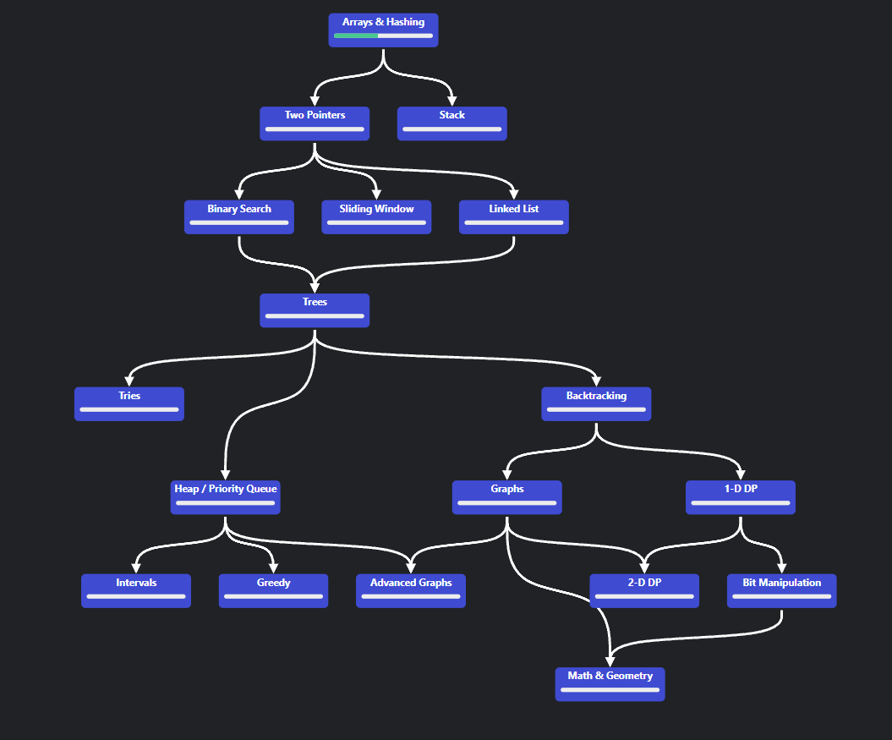

I started to work through LeetCode Problems in order to apply and test my knowledge of Data Structures and Algorithms.

I am mainly using the [NeetCode Roadmap](https://neetcode.io/roadmap) to organize my LeetCode learning content.

Solutions and small explanations of the LeetCode Problems can be in the jupyter notebook files in the folder [NeetCode_Roadmap](NeetCode_Roadmap)
